# 基于SpringBoot与Uni-app的校园互助系统的设计与实现（信息管理版）

> 公开脱敏版：保留论文正文与技术插图；学校模板、页眉页脚、校徽、身份元数据不进入公开文件，含个人资料或凭据的截图已隐藏。

目 录

## 绪论

### 选题背景

在当今数字化和网络化日益发展的背景下，社交媒体和网络平台已成为校园生活中不可或缺的一部分。这种趋势激发了对基于Spring Boot与Uni-app的校园互助系统的需求，旨在提供一个更加便捷、安全且用户友好的校园互助平台。

此系统的设计和实现具有重要的研究意义和实用价值。首先，它采用了前后端分离的开发模式，后端使用Spring Boot框架与Maven进行构建，前端则采用了流行的Vue.js框架。这种模式不仅提高了开发效率，也确保了应用程序在不同设备和平台上的兼容性和性能。

其次，系统注重信息安全，通过多种措施保护用户隐私和数据安全，提供了更高层次的数据保护。这对于校园环境中敏感信息和个人隐私的保护尤为重要。

此外，系统还包含了丰富的功能，如资源共享、信息交流和互助服务，为校园内学生提供了一个便捷而安全的平台，促进了学生之间的互助和合作。

综上所述，基于Spring Boot与Uni-app的校园互助系统不仅满足了现代校园生活的需求，也推动了前端和后端技术的融合与创新。它的设计与实现对于促进校园社交互动，增强校园资源共享和学生合作，以及提升校园应用的安全性和用户体验都具有深远的意义。

### 国内外发展现状

在国内外，校园互助系统得到了广泛的发展和应用。随着数字化技术的不断进步，校园互助系统在提升校园生活质量、促进学生之间互助合作方面发挥着重要作用。

国外的一些知名高校已经建立了成熟的校园互助系统，这些系统往往涵盖了课程资料分享、学术讨论、社团活动组织等功能，为学生提供了一个全面的学习和交流平台。例如，美国的一些大学通过校园互助系统帮助学生解决学习和生活中的问题，促进了学生之间的交流和合作。

在国内，随着互联网技术的不断普及，越来越多的高校开始关注和建设校园互助系统。一些知名高校已经推出了自己的校园互助平台，为学生提供了课程资料共享、学习资源获取、学术交流等服务。此外，一些互联网企业也积极参与到校园互助系统的建设中，推出了各种针对校园生活的应用软件，如校园活动组织、二手物品交易、心理咨询等。

总的来说，国内外的校园互助系统发展迅速，已经成为学生生活中不可或缺的一部分。未来随着技术的不断创新和应用场景的扩展，校园互助系统将会进一步完善，为学生提供更加便捷、全面的服务，促进校园内部资源的共享和学生之间的合作交流。

### 目的与意义

这一选题旨在利用现代技术手段，结合Spring Boot作为后端框架和Uni-app作为前端框架，构建一套完整的校园互助系统。通过该系统，旨在满足大学生在学业、生活和社交方面的需求，促进校园内的知识共享、技能合作以及社交网络的拓展。系统将提供学业辅助、生活帮助、技能分享和社交互动等功能，以建立一个共建共享的校园社群，为学生提供更为便捷、高效的互助平台。

促进知识共享与学业提升： 通过系统的学业互助功能，学生可以分享知识、解决学科难题，促进学术氛围，提高整体学业水平，使得学术资源更为平等地得到共享。

提高生活质量与解决实际问题： 校园互助系统不仅仅关注学业，还包括解决日常生活中的各种实际问题。学生可以在系统中找到解决方案，提高生活质量，减轻生活压力。

拓展社交网络与合作机会： 通过系统的社交互动功能，学生有机会拓展社交网络，结识志同道合的伙伴。技能分享和合作机会的提供，将促使学生在团队协作中培养更多的实际能力。

推动校园文化建设： 校园互助系统有助于形成更加紧密的校园社群，推动校园文化建设。通过共建共享的理念，促进校园文化的繁荣，培养学生的社会责任感和团队协作精神。

引入先进技术推动校园发展： 选题中使用的Spring Boot和Uni-app等现代技术框架，将有助于推动校园信息化建设，引入先进的技术手段，为学生提供更为便捷、高效的服务，推动整个校园的发展与创新。

综上所述，基于Spring Boot与Uni-app的校园互助系统的设计与实现具有显著的实际意义，不仅可以解决学生在学业和生活中的问题，还能够促进校园文化的发展，推动校园信息化建设，为学生的全面发展提供有力支持。

## 关键技术介绍

### 关键性开发技术介绍

#### Spring Boot

Spring Boot框架是Spring框架的一个分支，Spring Boot是所有基于Spring开发的项目的起点。Spring Boot的设计是为了让你尽可能快的跑起来Spring应用程序并且尽可能减少你的配置文件。简单来说就是Spring Boot其实不是什么新的框架，它默认配置了很多框架的使用方式，就像maven整合了所有的jar包，spring boot整合了所有的框架。它有两个优点：可以随时使用，并且可以缩小而不是配置。开箱即用的意思是通过向Maven项目的POM文件中添加相关的软件包并用相应的注释替换冗长的XML配置文件来管理对象的生命周期。此特性允许开发人员摆脱复杂的配置工作和依赖关系管理，并将更多精力放在代码的业务逻辑上。约定大于配置是一种软件设计范例，其中Spring Boot配置目标结构，开发人员向目标结构添加信息。尽管此功能降低了灵活性并增加了错误定位的复杂性，但它减少了开发人员需要做出的决策数量，减少了XML配置的数量，并且可以自动执行代码编译、测试和打包。

#### Vue与Uni-app

Vue.js 是一款轻量级、高效且易于上手的 JavaScript 框架，用于构建用户界面和单页面应用。Vue 的核心特性包括声明式渲染、组件化、响应式数据绑定和虚拟 DOM，使得开发者能够更高效地构建可维护和可扩展的 Web 应用。Vue.js 支持插件系统和周边生态，例如 Vuex（状态管理）和 Vue Router（路由管理），进一步提升了其在复杂项目中的实用性。

Uni-App 是一个使用 Vue.js 开发跨平台应用的前端框架。开发者通过编写 Vue.js 代码，Uni-App 将其编译到iOS、Android、微信小程序等多个平台，保证其正确运行并达到优秀体验。Uni-App 继承自 Vue.js，提供了完整的 Vue.js 开发体验。Uni-App组件规范和扩展API与微信小程序基本相同。有一定 Vue.js 和微信小程序开发经验的开发者可快速上手 Uni-App ，开发出兼容多端的应用。Uni-App提供了条件编译优化，可以优雅的为某平台写个性化代码、调用专有能力而不影响其他平台。

#### MySQL数据库

MySQL是一种开源的关系型数据库管理系统（RDBMS），由瑞典MySQL AB公司开发，现为Oracle公司旗下产品。MySQL以其高性能、可靠性和开放源代码的特点而闻名。它支持多种操作系统，包括Windows、Linux和Mac OS，同时提供了丰富的SQL语法和功能，使其成为广泛应用于Web开发、企业级应用等领域的数据库选择。

在基于Spring Boot与Uni-app的校园互助系统中，MySQL是我们选择的主要数据库。它被用于存储用户信息、发布的内容、评论数据等关键信息。通过使用MySQL，我们能够建立起高效、可扩展的数据库结构，确保系统能够存储和检索大量数据。MySQL的事务管理和数据完整性保障了系统在并发操作和数据操作方面的稳定性，为系统提供了可靠的数据支持。

#### MyBatis-Plus

MyBatis-Plus（简称MP）是MyBatis框架的增强工具包，为MyBatis提供了更多实用的功能和便捷的操作。它简化了MyBatis的使用流程，提供了更多方便的注解和API，支持代码生成、分页查询、性能分析等功能。MyBatis-Plus旨在提高开发效率，减少重复代码，使得MyBatis的使用更加简单和便捷。

在基于Spring Boot与Uni-app的校园互助系统中，我们采用了MyBatis-Plus作为持久层框架。它大大简化了数据库操作的代码，通过代码生成工具，能够自动生成实体类、Mapper接口和XML映射文件，减轻了开发者的重复工作。同时，MyBatis-Plus提供了强大的查询构建器，支持链式调用，使得复杂的查询变得更加简单和直观。

MyBatis-Plus还提供了基于注解的CRUD操作，极大地减少了SQL语句的编写，提高了开发效率。其内置的分页插件支持灵活的分页查询，为系统中的数据分页展示提供了良好的支持。

### 其它相关技术

#### HTTP请求

HTTP（Hypertext Transfer Protocol）是一种用于传输超文本的协议，是Web上数据通信的基础。它基于请求-响应模型，客户端通过发送HTTP请求向服务器请求资源，服务器通过HTTP响应返回请求的资源。HTTP通常运行在TCP协议之上，使用URL作为统一资源定位符来标识资源。HTTP请求方法包括GET、POST、PUT、DELETE等，而请求头和请求体则包含了传输的详细信息。

在基于Spring Boot与Uni-app的校园互助系统中，HTTP请求是系统与前端、其他服务之间进行信息交互的关键手段。通过HTTP请求，前端可以向后端发送各种类型的请求，如获取数据、提交表单、上传文件等。系统后端则通过HTTP响应返回相应的结果，实现前后端的数据交流。

#### Maven

要用Java实现一个后台系统，需要涉及很多模块。Web应用服务器、文件服务器、等。我们要开发这些模块，就要先把他们各自需要依赖的jar包或者项目下载打包好，然后配置到项目的class path中。需要注意的是，这些应用在运行单元测试pr编译或者部署的时候，需要依赖本地的一些配置，比如jdk、Web容器等，这样我们将项目分享出去的时候，别人要使用就有一定的配置门槛。Maven的作用就是帮我们完成上述所有的工作。

## 系统分析

### 系统可行性分析

针对校园互助系统的技术可行性进行分析，首先需要考虑系统开发过程中可能遇到的技术性问题，并评估当下技术是否能够解决这些问题。目前，我国已经存在许多校园互助系统，技术也相对成熟，因此在技术上实现并无困难。

从硬件角度来看，计算机具备足够的运行效率，能够满足校园互助系统的开发需求。系统软件数据库采用MySQL，在数据量不超过百万级的情况下，MySQL的速度不受影响。采用Java语言进行开发，Java拥有完善的框架体系，开发过程中的技术问题可以轻松解决。

在开发过程中所使用的技术和框架，如Spring Boot、MyBatis、Vue、MySQL等，都是免费且开源的。编译器如IDEA或WebStorm也对学生免费提供，从经济角度上来看，系统的开发是可行的。

在法律层面上，项目使用的代码是开源的或者自主开发的，不存在商业侵权问题，因此不会面临法律风险。

对于系统后期的运行，可以采用Linux系统运行后台，部署在阿里云服务器上，如果并发量增大，可以考虑使用多台服务器，从而保证系统的正常运行。

综合分析技术、经济和法律层面，当前项目在技术上具备高度可行性。采用成熟的技术和开源框架，硬件和软件资源充足，开发和运行过程无明显障碍。经济上的可行性得以确保，采用免费开源工具和服务，降低了开发成本。法律层面上，项目避免了商业侵权问题。综合而言，项目的技术、经济和法律可行性均得到充分考虑，为顺利开发和后期运行提供了有力支持。

### 系统功能需求分析

从用户角度分析，该系统主要面向两类用户：校园App用户和后台管理用户。校园App用户是系统的主要使用者，他们通过App进行注册、登录、浏览图片内容、浏览论坛、以及管理个人信息等操作。这些功能使校园App用户能够在系统中发布内容、浏览感兴趣的内容，并与其他用户互动，校园App用户用例图如图3.1所示。

图3.1 系统用户用例图

系统用户功能详解如下所示：

（1）注册用例，校园App用户输入账号，密码，选择头像进行注册，系统会对敏感数据进行唯一性检测，用例描述如表3.1所示。

表3.1 校园用户注册用例

<table>
<tr><td>用例名称</td><td>注册用例</td></tr>
<tr><td>参与者</td><td>校园用户</td></tr>
<tr><td>描述</td><td>App用户注册</td></tr>
<tr><td>前置条件</td><td>用户进入注册页面</td></tr>
<tr><td>后置条件</td><td>如果注册成功，用户可以使用该账号和密码进行App登录。 如果注册失败，用户得到相应提示，需要重新填写注册信息。</td></tr>
<tr><td>事件流</td><td>用户在注册页面输入姓名、账号、密码，并选择头像。 系统对用户输入的账号进行重复性校验，确保账号的唯一性。 如果账号已存在，系统提示用户输入其他账号。 如果账号不存在，系统继续进行下一步验证。 系统对用户输入的密码进行签名加密，确保安全性。 用户成功通过账号重复性校验后，系统生成唯一用户标识，并将用户信息存储在数据库中。 系统提示用户注册成功，用户可以使用该账号和密码进行App登录。 如果用户输入的账号已存在，系统提示用户选择其他账号。 如果用户输入的密码不符合规范，系统提示用户密码需符合特定要求。 如果用户注册失败，系统提示用户相关注册失败信息。</td></tr>
</table>

（2）登录用例，校园App用户输入注册用例注册成功的账号与密码进行系统登录，以访问某些需要登录的功能，用例描述如表3.2所示。

表3.2 校园用户登录用例

<table>
<tr><td>用例名称</td><td>校园用户登录用例</td></tr>
<tr><td>参与者</td><td>校园用户</td></tr>
<tr><td>描述</td><td>输入账号与密码进行App登录</td></tr>
<tr><td>前置条件</td><td>用户已经进入登录页面</td></tr>
<tr><td>后置条件</td><td>如果验证通过，用户获得唯一凭证，可以使用其他功能。 如果验证未通过，用户得到相应提示，需要重新输入正确的账号和密码。</td></tr>
<tr><td>事件流</td><td>用户在登录页面输入账号和密码。 系统对用户输入的账号和密码进行验证。 确认账号和密码是否符合规范。 验证账号和密码是否匹配系统记录的用户凭证。 如果验证通过，系统生成该用户的唯一凭证。 用户获得凭证后，可以通过该凭证使用其他功能。 如果验证未通过，系统提示用户身份验证失败。 如果用户输入的账号或密码不符合规范，系统提示用户正确填写账号和密码。 如果用户输入的账号不存在，系统提示用户该账号不存在，请重新输入。 如果用户输入的密码与账号不匹配，系统提示用户密码错误，请重新输入。</td></tr>
</table>

（3）图片内容浏览，进入App的用户可以进行图片内容浏览，并对喜欢的图片内容进行收藏，也可以上传自己喜欢的图片内容，用例描述如表3.3所示。

表3.3 图片内容浏览用例

<table>
<tr><td>用例名称</td><td>图片内容浏览用例</td></tr>
<tr><td>参与者</td><td>校园用户</td></tr>
<tr><td>描述</td><td>分类浏览图片内容，图片内容收藏，发布图片内容</td></tr>
<tr><td>前置条件</td><td>用户在App首页界面</td></tr>
<tr><td>后置条件</td><td>如果用户未登录，则无法进行图片内容收藏，发布。</td></tr>
<tr><td>事件流</td><td>用户在App首页界面选择图片分类。 系统展示所选分类下的所有图片，并提供排序选项。 用户选择某一排序方式，例如按时间、名称等。 系统按照用户选择的排序方式重新展示图片列表。 用户可以通过滚动、点击等方式浏览和查看图片详细信息。 用户可以收藏图片，用户点击收藏按钮。系统将该图片添加到用户的收藏夹中。</td></tr>
</table>

（4）论坛浏览：校园App用户可以进行论坛内容浏览，并对论坛内容进行评论，点赞，收藏，用例描述如表3.4所示。

表3.4 论坛浏览用例

<table>
<tr><td>用例名称</td><td>论坛浏览用例</td></tr>
<tr><td>参与者</td><td>校园用户</td></tr>
<tr><td>描述</td><td>论坛内容点赞，收藏，查询，评论，回复</td></tr>
<tr><td>前置条件</td><td>用户进入到论坛界面</td></tr>
<tr><td>后置条件</td><td>未登录的用户只能进行浏览操作。</td></tr>
<tr><td>事件流</td><td>用户点击某一个论坛内容，进入内容详情界面。 用户可以在详情界面进行评论，并查看其他用户的评论。 用户可以对论坛内容进行点赞。 如果用户输入的关键字无匹配结果，系统提示用户调整关键字。 如果用户在浏览过程中遇到问题，系统提供友好的反馈和帮助。</td></tr>
</table>

（5）个人管理：校园App用户可以在个人中心界面查看自己发布的图片内容，论坛内容等，并可以对这些内容进行管理，用例描述如表3.5所示。

表3.5 个人管理用例

<table>
<tr><td>用例名称</td><td>个人管理用例</td></tr>
<tr><td>参与者</td><td>校园用户</td></tr>
<tr><td>描述</td><td>查看，统计，管理与自己有关的数据</td></tr>
<tr><td>前置条件</td><td>用户已登录到App，访问了个人管理界面</td></tr>
<tr><td>后置条件</td><td>用户能够方便地管理个人上传的图片和发布的论坛内容。 用户可以随时查看个人在App中的信息统计。。</td></tr>
<tr><td>事件流</td><td>用户进入个人管理界面。 用户可以查看个人收藏的图片。 用户可以上传新图片，添加到个人收藏。 用户可以管理自己上传的图片，包括编辑、删除等操作。 用户可以查看并管理自己发布的论坛内容，包括编辑、删除等操作。 用户可以查看本人在App中的信息统计，包括收藏数、点赞数、评论数等。 如果用户在上传图片过程中遇到问题，系统提供相应的错误提示和帮助信息。 如果用户在管理图片或论坛内容时遇到问题，系统提供友好的反馈和解决方案。</td></tr>
</table>

后台管理用户负责管理校园App用户、图片内容、论坛，并进行信息统计。这些职责共同构筑了一个内容审核平台，旨在保持App整体氛围的和谐，用例图的具体展示可参考图3.2。

图3.2 后台管理用户用例图

系统管理员功能详解：

（1）登录：后台管理用户输入账号与密码登入后台系统，用例描述如表3.6所示。

表3.6 登录用例

<table>
<tr><td>用例名称</td><td>登录用例</td></tr>
<tr><td>参与者</td><td>后台管理用户</td></tr>
<tr><td>描述</td><td>输入账号与密码登入后台系统</td></tr>
<tr><td>前置条件</td><td>管理员已进入后台登录页面</td></tr>
<tr><td>后置条件</td><td>如果登录成功，管理员获得唯一票据，可以进行后台操作。 如果登录失败，系统提供相应提示，管理员需要重新输入正确的账号和密码。</td></tr>
<tr><td>事件流</td><td>管理员在后台登录页面输入账号和密码。 系统对管理员输入的账号和密码进行校验。 确认账号和密码是否有效。 如果校验通过，系统生成唯一票据用于后续操作的身份识别。 管理员登录成功，进入后台管理界面。 如果管理员输入的账号或密码不符合规范，系统提示管理员正确填写账号和密码。 如果管理员输入的账号不存在，系统提示管理员该账号不存在，请重新输入。 如果管理员输入的密码与账号不匹配，系统提示管理员密码错误，请重新输入。</td></tr>
</table>

校园App用户管理：登录成功的后台管理员用户可以在系统后台对所有校园App用户进行管理，并查看他们发布的内容，用例描述如表3.7所示。

表3.7 校园App用户管理用例

<table>
<tr><td>用例名称</td><td>校园App用户管理用例</td></tr>
<tr><td>参与者</td><td>后台管理用户</td></tr>
<tr><td>描述</td><td>查看校园App用户发布的内容</td></tr>
<tr><td>前置条件</td><td>管理员已登录到后台管理界面</td></tr>
<tr><td>后置条件</td><td>管理员能够方便地进行用户信息模糊查询，并查看相关数据统计。</td></tr>
<tr><td>事件流</td><td>管理员进入校园App用户信息查询界面。 管理员输入要查询的用户名称的关键字进行模糊查询。 系统返回与关键字匹配的用户列表，包括用户的基本信息。 管理员选择某一用户，系统展示该用户在App中的数据统计内容。 包括用户的活跃度、收藏数、点赞数、评论数等。</td></tr>
</table>

（3）图片内容管理：查询系统中所有图片内容，并对不符合规定的内容进行删除操作，用例描述如表3.8所示。

表3.8 图片内容管理用例

<table>
<tr><td>用例名称</td><td>图片内容管理用例</td></tr>
<tr><td>参与者</td><td>后台管理用户</td></tr>
<tr><td>描述</td><td>管理校园App的图片内容</td></tr>
<tr><td>前置条件</td><td>管理员已登录到后台管理界面</td></tr>
<tr><td>后置条件</td><td>管理员能够方便地进行图片信息检索、分类和管理。 违规图片被删除，确保App中的图片内容符合规范。</td></tr>
<tr><td>事件流</td><td>管理员进入图片管理界面。 管理员可以进行图片信息的名称检索，输入关键字进行模糊查询。 管理员可以进行分类检索，筛选出符合特定分类标准的图片。 系统返回符合检索条件的图片列表，包括图片的基本信息。 管理员可以选择某一图片，查看详细信息。 管理员可以进行违规图片的删除，确保图片内容符合社区准则。</td></tr>
</table>

（4）论坛管理：管理员查看校园App的论坛内容，查看评论内容，并对不符规定的内容进行删除，用例描述如表3.9所示。

表3.9 论坛管理用例

<table>
<tr><td>用例名称</td><td>论坛管理用例</td></tr>
<tr><td>参与者</td><td>后台管理用户</td></tr>
<tr><td>描述</td><td>管理校园App的论坛内容</td></tr>
<tr><td>前置条件</td><td>管理员已登录到后台管理界面</td></tr>
<tr><td>后置条件</td><td>管理员能够方便地通过名称检索论坛内容，查看评论，并进行删除操作。 违规评论被删除，确保App中的论坛内容符合规范。</td></tr>
<tr><td>事件流</td><td>管理员进入论坛管理界面。 管理员可以通过名称检索论坛内容，输入关键字进行模糊查询。 系统返回符合检索条件的论坛内容列表，包括论坛的基本信息。 管理员可以选择某一论坛，查看详细信息。 管理员可以查看该论坛的评论内容，了解用户互动情况。 管理员可以对评论内容进行删除，确保评论内容符合社区规范。 管理员可以选择删除整个论坛内容，以维护App整体氛围。</td></tr>
</table>

### 非功能性需求分析

实时性：系统确保用户上传的信息及时展示，评论和点赞等操作实时同步，保证每位用户的作品都能得到展示和发现，增强用户之间的互动体验。

安全性：系统在用户登录时采取了安全措施，防止用户账户受到SQL注入等安全威胁的侵害，保障用户信息的安全性。

移植性：系统采用Java语言进行后台开发，Java具有良好的移植性，可以在多个操作系统上运行，只需安装相应版本的JDK即可，确保系统在不同环境下的稳定运行。

### 本章小结

本章旨在通过需求分析来确立系统的用户类型以及不同用户类型所涉及的用例。根据不同用户的角色和需求，系统的功能被细分为相应的用例，以确保系统能够满足各类用户的需求。通过明确定义不同用户类型的用例，可以为系统设计提供清晰的指导，同时也为后续的系统开发和测试工作奠定了基础。这一过程有助于确保系统能够充分满足用户的功能需求，提高系统的可用性和用户满意度。

## 系统设计

### 架构设计

系统整体上使用的是B/S架构模式，然后系统前端分为App端与后台PC管理端，这也是B/S模式中的浏览器，客户端，服务端整体为Spring Boot框架，数据层使用了MyBatis，数据库为MySQL数据库，因此本系统的总体架构流程为：App端或者PC端使用HTTP通信机制，请求服务端接口，这里涉及到了跨域请求，因此服务端需要进行跨域处理，然后服务端的接口使用MyBatis操作数据库MySQL，然后将操作结果通过JSON返回，具体的架构图如图4.1系统架构图所示。

图4.1 系统架构图

1. 前端架构：

Uni-app与Vue：采用Uni-app框架构建跨平台的前端应用，其中Vue作为主要的前端开发框架，确保在不同平台上保持一致的用户体验。

界面构建：使用Uni-app构建App界面，同时采用Vue构建Web端界面。为了提高界面美观性和用户体验，整合color UI与ELM UI进行界面构造。

数据交互：通过Axios与Ajax进行前后端的数据交互，支持主要的HTTP请求类型，包括POST与GET。

2. 后端架构：

Spring Boot框架：作为服务端的主要开发框架，提供快速搭建与开发的优势，支持RESTful API的开发。

SSM架构：使用Spring、Spring MVC和MyBatis的组合，实现了系统的业务逻辑、控制层和持久层的分离。

全局异常与返回处理：实现全局异常处理机制，确保系统在面对异常情况时能够友好地向前端返回响应。

数据交互与事务处理：利用ORM框架进行数据库操作，确保数据的一致性。采用声明式事务机制，保证用户操作的原子性。

全局日志：使用AOP进行全局操作日志记录。

3. 数据库：

MySQL数据库：作为主要的数据存储方案，存储内容，用户，点赞，评论，收藏，敏感词等基本信息。设计规范化的数据库结构以支持系统的扩展与维护。

4. 数据流与交互：

HTTP请求：前端通过HTTP请求向后端API请求数据，包括用户信息、互助服务信息等。

后端处理：后端接收到请求后，进行相应的业务处理，通过MyBatis与MySQL数据库交互，实现数据的增删改查。

Response返回：后端将处理结果通过HTTP Response返回给前端，确保前后端之间的有效数据流。

### 功能设计

#### 校园App用户登录与注册功能设计

校园App用户首先进入注册页面，然后输入姓名、账号、密码，并选择头像，系统接收用户输入并对账号进行唯一性校验，再对密码进行签名加密。如果账号不存在，系统生成唯一用户标识，将用户信息存储在数据库中，并提示用户注册成功。替代流程包括账号已存在和密码不符合规范的情况，系统会相应提示用户。注册成功后，用户可以使用该账号和密码进行App登录，注册时序图如图4.2所示。

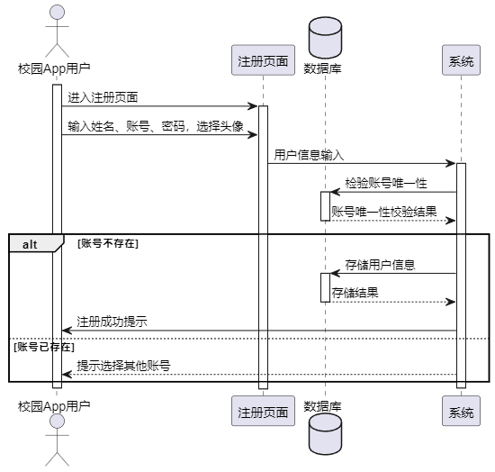

图4.2 注册时序图

校园App用户通过登录界面输入已注册成功的账号和密码。系统接收用户提供的账号和密码，对密码进行加密签名后，调用数据库进行账号和密码的验证。验证通过时，系统生成唯一凭证并返回给用户；验证未通过时，系统提示相应的未通过信息。登录的详细时序图可参考图4.3。

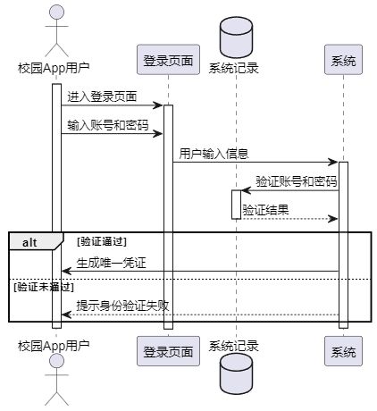

图4.3 登录时序图

#### 论坛浏览功能设计

App用户进入信息浏览界面，通过浏览界面可以查询论坛内容，向系统发送查询请求。系统与系统记录（数据库）进行交互，获取论坛内容的结果，并将结果返回给系统。用户在浏览界面选择了排序方式，然后发布了自己的论坛内容。系统对用户发布的论坛内容进行存储，将信息存储在系统记录中。如果用户点击了论坛内容，系统会获取论坛内容的详细信息，包括评论和点赞信息。用户可以在内容详情界面发表评论，系统将用户评论存储在系统记录中。用户还可以点赞论坛内容，系统会处理点赞请求，并将结果存储在系统记录中，时序图如图4.4所示。

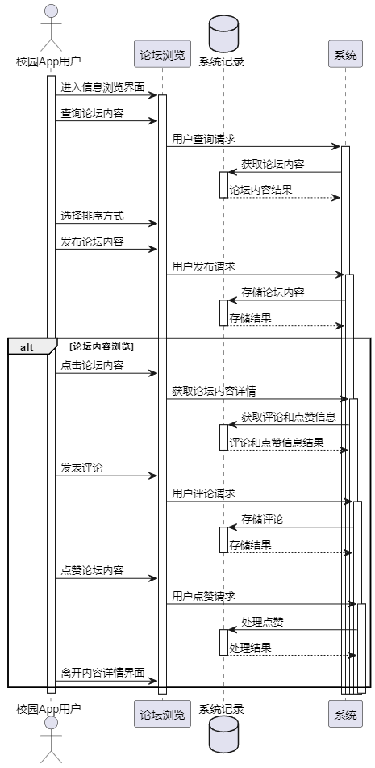

图4.4 论坛浏览时序图

#### 图片内容浏览功能设计

校园App用户首先在图片内容浏览界面选择图片内容分类，系统响应用户的请求并展示所选分类下的图片内容列表。用户可以进一步选择排序方式，系统重新排序并展示图片内容。用户在图片列表中浏览和查看详细信息，校园App用户还可以通过点击收藏按钮将图片内容添加到个人收藏夹中，便于后续查看，时序图如图4.5所示。

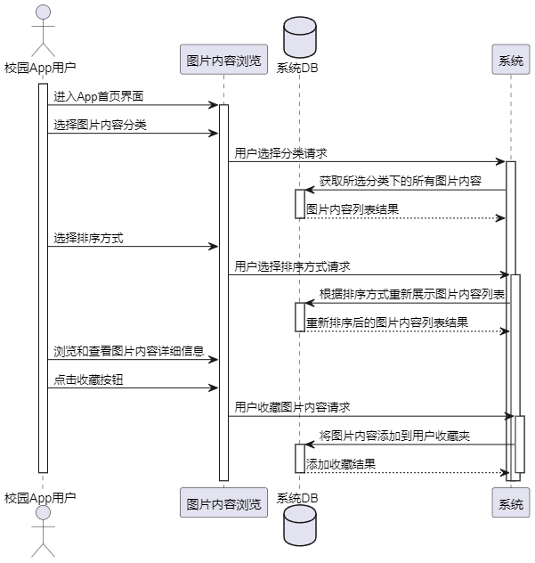

图4.5 图片浏览时序图

#### 个人管理功能设计

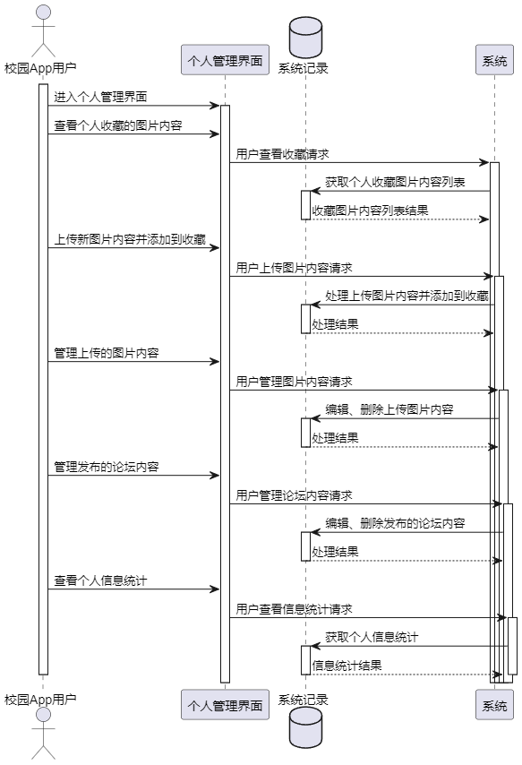

图4.6 个人管理时序图

校园App用户进入个人管理界面，选择查看个人收藏的图片内容。个人管理界面发送查看收藏请求给系统，系统接收请求后向数据库发送获取个人收藏图片内容列表的请求。数据库处理请求并返回收藏图片列表给系统。

校园App用户上传新图片内容，个人管理界面发送上传图片请求给系统，系统接收请求后向数据库发送处理上传图片内容的请求，数据库处理请求并返回结果给系统。

校园App用户在个人管理界面中选择管理上传的图片内容，进行编辑或删除操作，个人管理界面发送管理图片内容请求给系统，系统接收请求后向数据库发送编辑或删除上传图片的请求，数据库处理请求并返回结果给系统。

校园App用户在个人管理界面中选择管理发布的论坛内容，进行编辑或删除操作，个人管理界面发送管理论坛内容请求给系统，系统接收请求后向数据库发送编辑或删除发布的论坛内容的请求，数据库处理请求并返回结果给系统。

校园App用户在个人管理界面中选择查看个人信息统计，个人管理界面发送查看信息统计请求给系统，系统接收请求后向数据库发送获取个人信息统计的请求，数据库处理请求并返回个人信息统计结果给系统，时序图如图4.6所示。

#### 校园App用户管理功能设计

时序图如图4.7所示，该时序图描述了管理员在后台管理界面进行App用户信息查询的主要操作流程。管理员通过用户信息查询界面可以灵活地进行用户模糊查询，以便查看用户的基本信息和数据统计。

查询用户列表：管理员输入要查询的用户名称的关键字，系统根据关键字进行模糊查询，返回匹配的用户列表，包括基本信息。

查看用户数据统计：管理员选择某一用户后，系统获取该用户在App中的数据统计信息，包括活跃度、收藏数、点赞数、评论数等。

如果管理员输入的关键字无匹配结果，系统会提示管理员尝试其他关键字，提供更好的查询体验。

在查询过程中，如果管理员遇到问题，系统提供友好的反馈和帮助，确保管理员能够轻松地完成查询操作。

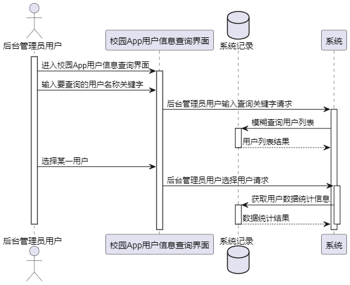

图4.7 校园App用户管理时序图

#### 论坛管理功能设计

论坛管理时序图如图4.8所示，该时序图描述了管理员在后台管理界面进行论坛管理的主要操作流程。管理员通过论坛管理界面能够有效地维护和管理App中的论坛内容。

查询论坛内容：管理员可以通过名称检索论坛内容，系统根据关键字进行模糊查询，返回符合检索条件的论坛内容列表，包括基本信息。

查看论坛详细信息：管理员可以选择某一论坛，系统获取该论坛的详细信息，包括论坛的内容和互动情况。

查看评论内容并删除：管理员能够查看论坛的评论内容，并对评论进行删除操作，确保评论内容符合社区规范。

删除整个论坛内容： 管理员可以选择删除整个论坛内容，以维护App整体氛围。

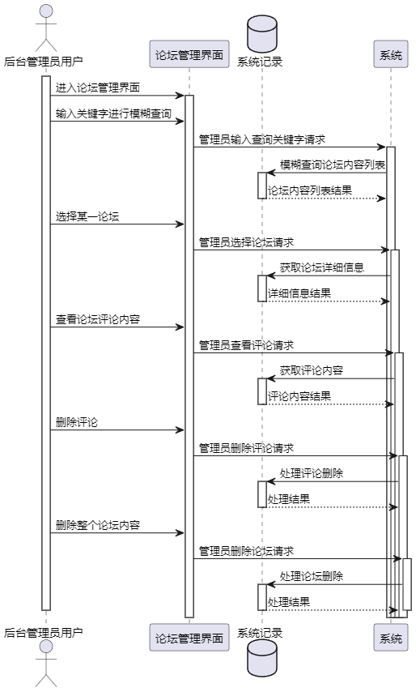

图4.8 论坛管理时序图

#### 图片内容管理功能设计

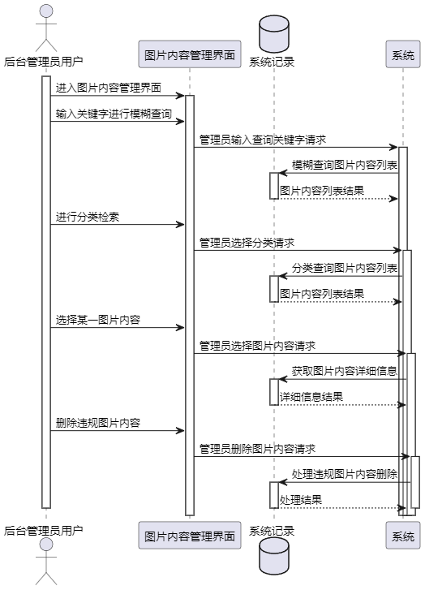

图4.9 图片内容管理时序图

图片内容管理时序图如图4.9所示，该时序图描述了管理员在后台管理界面进行图片内容管理的主要操作流程。管理员通过图片内容管理界面能够有效地维护和管理App中的图片内容。

查询图片内容：管理员可以通过名称检索图片信息，系统根据关键字进行模糊查询，返回符合检索条件的图片内容列表，包括基本信息。

分类检索图片内容：管理员可以进行分类检索，筛选出符合特定分类标准的图片内容，提供更精准的检索功能。

查看图片内容详细信息：管理员选择某一图片内容后，系统获取该图片内容的详细信息，包括图片内容的描述、分类等。

删除违规图片内容： 管理员可以对违规图片内容进行删除，确保图片内容符合社区准则，维护App中的图片库规范。

### 数据库设计

#### E-R图设计

通过功能设计与业务需求分析可以知道本系统应该具有8个实体：用户，评论，论坛，图片，收藏，分类，点赞，浏览，并且用户与评论，论坛，图片，收藏，点赞实体形成一对多关系，然后评论与论坛形成一对多关系，浏览与论坛形成多对一关系，图片与分类，收藏，点赞形成一对多关系，因此本系统的实体关系图如图4.10实体关系图所示。

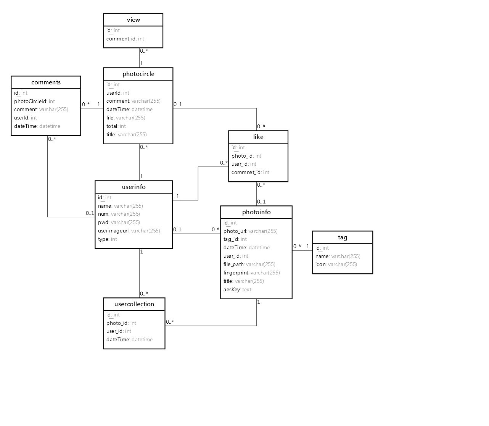

图4.10 实体关系图

#### 数据库表设计

用户表主要存储校园App用户与后台管理员用户的基本信息，比如登录账号，登录密码等，其中type字段用以区分该用户的类型，具体如表4.1所示

表4.1 用户表

<table>
<tr><td>字段名</td><td>数据类型</td><td>主键/允许空</td><td>字段含义</td></tr>
<tr><td>id</td><td>int</td><td>PRIMARY KEY</td><td>主键</td></tr>
<tr><td>name</td><td>varchar(255)</td><td>NULL</td><td>昵称</td></tr>
<tr><td>num</td><td>varchar(255)</td><td>NULL</td><td>登录账号</td></tr>
<tr><td>pwd</td><td>varchar(255)</td><td>NULL</td><td>登录密码</td></tr>
<tr><td>userimageurl</td><td>varchar(255)</td><td>NULL</td><td>头像</td></tr>
<tr><td>type</td><td>int</td><td>NULL</td><td>0App 1管理员</td></tr>
</table>

论坛浏览记录表与论坛表关联，主要存储该论坛内容的被浏览记录，具体如表4.2所示。

表4.2 论坛浏览记录表

<table>
<tr><td>字段名</td><td>数据类型</td><td>主键/允许空</td><td>字段含义</td></tr>
<tr><td>id</td><td>int</td><td>PRIMARY KEY</td><td>浏览表主键</td></tr>
<tr><td>comment_id</td><td>int</td><td>NOT NULL</td><td>论坛主键</td></tr>
</table>

收藏表主要字段未photo_id与图片内容表关联，user_id与用户表关联，具体如表4.3所示。

表4.3 收藏表

<table>
<tr><td>字段名</td><td>数据类型</td><td>主键/允许空</td><td>字段含义</td></tr>
<tr><td>id</td><td>int</td><td>PRIMARY KEY</td><td>收藏表主键</td></tr>
<tr><td>photo_id</td><td>int</td><td>NOT NULL</td><td>图片内容表主键</td></tr>
<tr><td>user_id</td><td>int</td><td>NOT NULL</td><td>用户表主键</td></tr>
<tr><td>dateTime</td><td>datetime</td><td>NOT NULL</td><td>收藏时间</td></tr>
</table>

图片内容表如表4.4所示，主要存储系统所有图片内容信息，字段tag_id与分类表关联。

表4.4 图片内容表

<table>
<tr><td>字段名</td><td>数据类型</td><td>主键/允许空</td><td>字段含义</td></tr>
<tr><td>id</td><td>int</td><td>PRIMARY KEY</td><td>主键</td></tr>
<tr><td>photo_url</td><td>varchar(255)</td><td>NOT NULL</td><td>图片内容静态访问地址</td></tr>
<tr><td>tag_id</td><td>int</td><td>NOT NULL</td><td>分类id</td></tr>
<tr><td>dateTime</td><td>datetime</td><td>NOT NULL</td><td>上传时间</td></tr>
<tr><td>user_id</td><td>int</td><td>NULL</td><td>上传用户</td></tr>
<tr><td>title</td><td>varchar(255)</td><td>NULL</td><td>图片内容标题</td></tr>
</table>

论坛表主要字段为userId关联用户表，具体如表4.5所示。

表4.5 论坛表

<table>
<tr><td>字段名</td><td>数据类型</td><td>主键/允许空</td><td>字段含义</td></tr>
<tr><td>id</td><td>int</td><td>PRIMARY KEY</td><td>主键</td></tr>
<tr><td>userId</td><td>int</td><td>NOT NULL</td><td>用户表主键</td></tr>
<tr><td>comment</td><td>varchar(255)</td><td>NULL</td><td>内容</td></tr>
<tr><td>dateTime</td><td>datetime</td><td>NULL</td><td>发表时间</td></tr>
<tr><td>file</td><td>text</td><td>NULL</td><td>附件信息</td></tr>
<tr><td>total</td><td>int</td><td>NULL</td><td>评论数</td></tr>
<tr><td>title</td><td>varchar(255)</td><td>NULL</td><td>标题</td></tr>
</table>

### 本章小结

本章主要进行了系统架构设计，确定系统架构组成，然后对系统功能进行设计，并辅以时序图使其更加清晰，最后根据时序图与需求分析完成了数据库设计。

## 系统实现

### 校园App注册与登录实现

注册界面采用Form表单形式，如图5.1所示，通过点击事件@submit获取用户输入的姓名、账号、密码等信息。图片上传使用uni.chooseImage函数，调用服务端图片上传接口uploadImgAddUser。在该接口中，利用Java的File类保存图片，并构造图片访问的静态地址，前端收到地址后进行绑定。注册接口addUser对用户输入的账号与密码进行AES加密，确保数据安全。

AES加密功能通过注解实现。定义@EncrptInfo方法注解和@EncryptColumn字段注解。AopEncryptInfo切面捕捉所有被@EncrptInfo注解标记的方法。前置通知doBefore检查isEnOrDe值是否为真，进行加密。后置通知doAfter如果isEnOrDe值为假，表示解密，对返回的UserInfo对象中指定字段进行解密。加密和解密逻辑在encryptObject和getParamByName方法中，使用反射操作对象字段。实际加密和解密由AesUtil的静态方法执行。

图5.1 注册界面

App登录界面如图5.2App登录所示，整体实现过程与注册一致，前端使用Form表单的形式，然后服务端对用户输入的账号与密码，进行条件查询，查看是否有符合条件的值，如果有就生成Token，然后将用户信息存入本地现成UserThreadLocal中，然后通过构造函数，完成用户基本信息的构造，在返回给前端，前端对Token与用户基本信息进行缓存，同样的登录接口上也有AOP的AES加密注解EncrptInfo，使系统自动对用户输入的账号与密码进行加密处理。

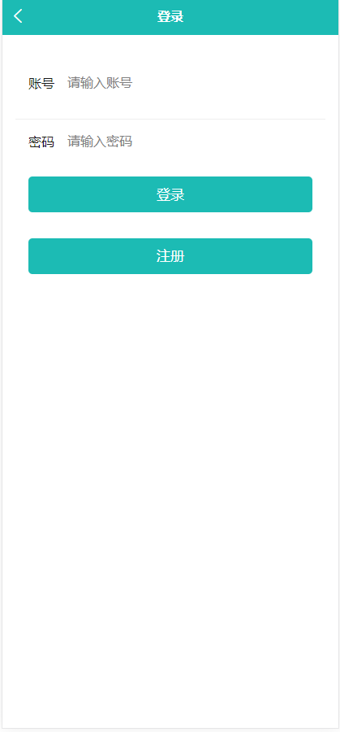

图5.2 登录界面

### 图片内容浏览功能实现

#### 分类排序查询实现

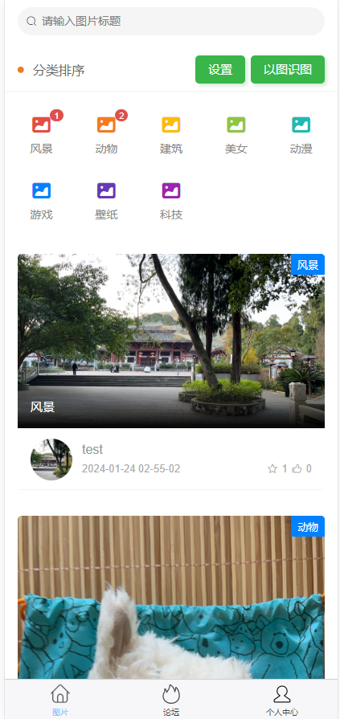

图5.3 APP首页

App首页界面如图5.3首页所示，首页主要查看本系统中App用户或者后台管理用户上传的图片，进入首页会访问服务端接口/photo/app/list，获取所有图片信息，这里进行了分页查询与链接查询，图片表与分类表有外键关系，通过外键链接查询，查出每张图片对应的分类信息，然后在使用PageHelper分页插件进行分页实现，前端使用v-for="item in list"对接口返回的图片List进行循环展示，然后使用{{}}进行值得绑定。

首页上方为标题模糊查询，分类查询，排序查询入口，分类列表的获取由接口tagList实现，使用了select，left join on count group by关键字进行条件查询，并统计出每个分类下图片的结果，前端部分在使用v-for进行循环展示。

用户在输入框中输入内容，点击键盘上的确认或者回车，触发前端函数searchHandle，在该函数中，使用双向绑定与前端this指针，将data中的数据title赋值为用户输入的值，然后清空分页查询方法，再次访问函数getData，请求服务端接口/photo/app/list，服务端使用MyBatis的<where>与<choose>完成动态SQL拼接，结果如图5.4所示。

图5.4 图片查询结果

用户点击分类排序中的分类按钮，触发时间search，同样的方式将tagId的值赋值为用户点击的列表中的元素值，然后请求服务端接口，完成分类查询，用户点击设置按钮，App打开弹窗，弹窗通过v-if控制，用户可以选择排序方法，完成图片列表的排序查询，如图5.5所示。

图5.5 排序查询

#### 收藏点赞实现

用户点击列表中的收藏与点赞icon触发函数: addCollect与addLike，函数中使用uni.request进行接口请求，在接口首先使用Mapper接口进行数据库访问，检测该用户是否进行过收藏与点赞，如果有此类操作，则提示重复操作，如果没有则使用insert语句完成收藏与点赞操作如图5.6所示。

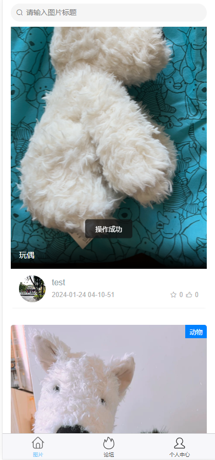

图5.6 收藏与点赞

### 论坛功能实现

#### 论坛浏览实现

论坛的内容与图片内容基一致，因此这里将图片列表前端代码抽成组件photo-card，定义两个props类list与type，由于论坛列表与图片列表有些地方展示效果不一样，因此定义type，配合v-if可以灵活展示不同区域，list为服务端来的图片列表数据与论坛列表数据，然后论坛同样可以进行下拉刷新与上拉加载，使用uni的onPullDownRefresh与onReachBottom函数，论坛列表界面如图5.7所示。

图5.7 App论坛列表

#### 论坛评论点赞收藏实现

用户同样可以点击点赞icon进行论坛内内容点赞，点击列表中的图片可以进行图片预览，点击图片上的文字可以查看该论坛的所有内容，当用户点击文字时，触发跳转函数detailInfo，并传入该内容的主键，跳转到内容详情界面，该界面以传入的主键为参数请求服务端接口，获取该内容的详细信息与评论信息，然后使用v-for="(comment,index) in commentList"语句对评论内容进行循环渲染展示。

用户可以在界面最下方输入评论，然后点击评论按钮，App请求服务端接口/api/photo/ addComment，评论成功后，App自动刷新页面，展示最新的评论信息，并通过评论字段reply与当前登录用户（登录界面缓存数据）与该发布内容用户（userId）的判断，判断是否显回复按钮与删除按钮，用户点击回复按钮，可以回复该评论内容，点击删除按钮，删除该评论，用户也可以在个人中心查看自己的评论内容，并进行删除，如图5.8所示。

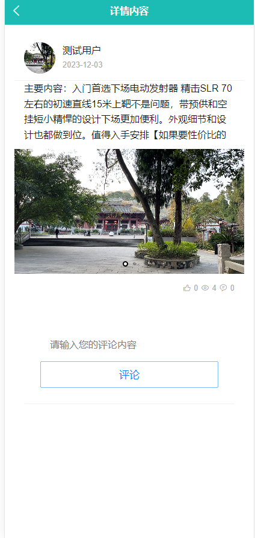

图5.8 论坛详情

#### 论坛发布实现

论坛发布界面如图5.9所示，界面整体是一个Form表单，用户输入完内容，选择完图片后，点击发布，App请求服务端接口addPhotoCircle，服务端使用insert语句将数据插入表中，然后App跳转界面至论坛界面。

图5.9 论坛发布

### 个人管理功能实现

#### 数据统计实现

个人中心界面如图5.10所示，用户点击头像可以修改个人信息，使用了的页面是注册页面，然后使用Vue的双向绑定将值渲染在上面，头像下方是操作导航栏，到导航栏中还有该用户在本App中的数值统计，由接口staticCount提供数据，最后是退出登录按钮。

图5.10 个人中心

#### 数据管理实现

我的收藏，我的点赞，我的图片内容，我的发布都是与论坛与图片内容有关，因此在实现这里的时候，一个页面展示这些内容，实现界面如图5.11所示，用户可以在此界面进行收藏/点赞/评论等数据的删除，还可以进行论坛详情页的查看操作。

图5.11 个人中心详情页

#### 图片内容上传实现

用户点击个人中心界面的上传图片内容按钮，App跳转到图片内容上传页面，页面整体为Form表单，图片内容上传界面如图5.12所示。

图5.12 图片内容上传

### 后台管理系统实现

#### 校园App用户管理实现

用户管理界面如图5.13所示。管理员能够查看系统中的所有App用户信息。系统服务端通过SELECT COUNT语句对App用户的操作进行全面统计，包括收藏总数、点赞总数等。此外，管理员还可以执行批量删除操作，并且支持对用户进行名字的模糊查询。服务端通过使用LIKE关键字实现模糊查询，并结合PageHelper插件实现了分页功能。前端界面采用了饿了么UI的el-pagination组件用于分页展示，同时使用el-table组件展示用户信息。这样的设计使得用户管理界面更加直观、功能丰富，提高了系统的易用性。

图5.13 校园App用户管理

#### 图片内容管理实现

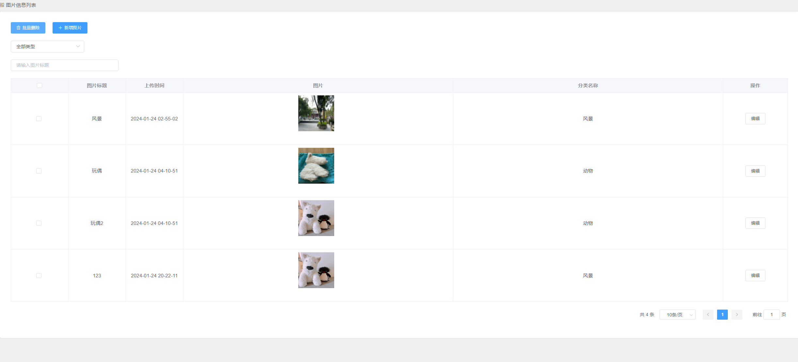

图5.14 图片内容管理

图片内容管理界面如图5.14所示，列表的实现方式与后台用户管理一致，使用了饿了么UI的Table组件，然后分页组件也是使用了此UI的el-pagination。

#### 论坛管理实现

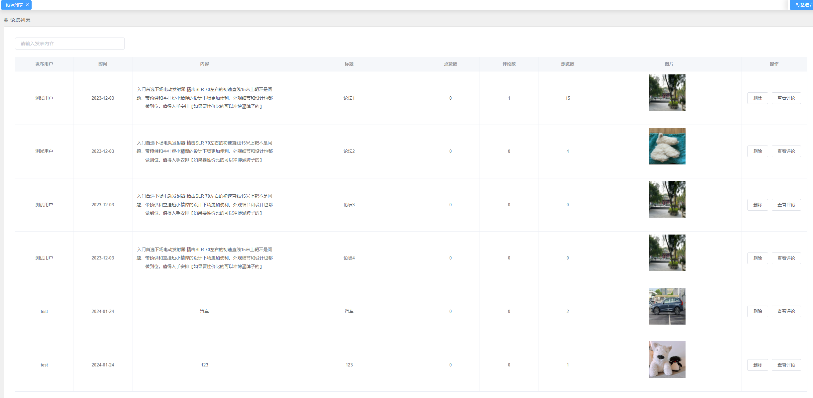

图5.15 列表

论坛列表界面如图5.15所示，管理员用户可以对论坛内容进行模糊查询，论坛内容删除，分页查询，管理员点击查看评论按钮，即可查看该论坛的评论时光轴如图5.16所示，管理员可以查看时间正序排序的用户评论，并可以删除不好的评论，来维持App的良好风气。

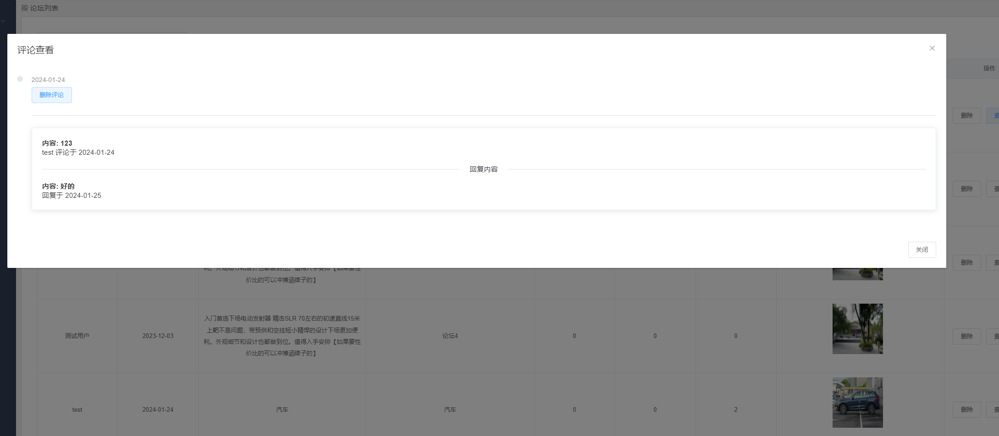

图5.16 评论查看

### 本章小结

本章主要阐述了系统功能实现过程，如果使用Vue，Spring Boot，Uni-app等技术与框架实现登录，注册，论坛浏览等功能。

## 系统测试

### 测试环境与方法

本系统拟采用黑盒测试的方法，通过测试来检测每个功能是否都能正常使用。在测试中，把程序看作一个不能打开的黑盒子，在完全不考虑程序内部结构和内部特性的情况下，在程序接口进行测试，它只检查程序功能是否按照需求规格说明书的规定正常使用，程序是否能适当地接收输入数据而产生正确的输出信息。

系统在开发环境下进行测试：

操作系统：Windows11；

开发语言版本：JDK 1.8；MySQL 8.0.19; Node 15.6；

编译器：WebStorm，IDEA。

### 测试用例

登录注册测试用例中，测试员主要模拟校园App用户进行注册与登录，主要测试注册过程中输入同样的账号是否被系统检测，登录过程中输入错误的账号与密码是否可以被系统检测。

表6.1 App登录注册测试用例表

<table>
<tr><td>测试序号</td><td>操作描述</td><td>数据</td><td>期望结果</td><td>实际结果</td><td>测试状态</td></tr>
<tr><td>1</td><td>进行系统注册，此时系统中有账号为cs的用户</td><td>账号cs，密码：123456</td><td>注册失败</td><td>账号重复</td><td>通过</td></tr>
<tr><td>2</td><td>进行系统注册，此时系统没有App用户</td><td>账号cs，密码：123456</td><td>注册成功</td><td>注册成功</td><td>通过</td></tr>
<tr><td>3</td><td>进行系统登录，测试系统有账号cs，密码123456</td><td>账号cs，密码：123456</td><td>登录成功</td><td>登录成功</td><td>通过</td></tr>
<tr><td>4</td><td>进行系统登录，测试系统有账号cs，密码123456</td><td>账号cs，密码：1234562</td><td>登录失败</td><td>登陆失败</td><td>通过</td></tr>
</table>

图片内容浏览测试用例中，主要测试未登录的用户是否可以进行点赞，收藏；测试图片内容搜索，排序是否正常，结果如表6.2所示。

表6.2 图片内容浏览测试用例表

<table>
<tr><td>测试序号</td><td>操作描述</td><td>数据</td><td>期望结果</td><td>实际结果</td><td>测试状态</td></tr>
<tr><td>1</td><td>未登录用户收藏</td><td>无</td><td>请登录</td><td>跳转登录界面</td><td>通过</td></tr>
<tr><td>2</td><td>登录用户进行收藏操作</td><td>图片内容1</td><td>收藏成功</td><td>收藏成功</td><td>通过</td></tr>
<tr><td>3</td><td>登录用户进行收藏操作</td><td>图片内容1</td><td>请勿重复收藏</td><td>请勿重复收藏</td><td>通过</td></tr>
<tr><td>4</td><td>进行图片内容排序查询</td><td>排序的内容</td><td>排序成功</td><td>排序成功</td><td>通过</td></tr>
<tr><td>5</td><td>进行图片内容模糊查询</td><td>模糊查询的内容</td><td>查询成功</td><td>查询成功</td><td>通过</td></tr>
</table>

论坛浏览测试用例中，同样测试系统是否有登录拦截，是否可以正常进行论坛内容的浏览与评论，评论回复操作，测试结果如表6.3所示。

表6.3 论坛浏览测试用例表

<table>
<tr><td>测试序号</td><td>操作描述</td><td>数据</td><td>期望结果</td><td>实际结果</td><td>测试状态</td></tr>
<tr><td>1</td><td>未登录用户进行论坛点赞，评论，收藏操作</td><td>论坛数据</td><td>请登录</td><td>请登录</td><td>通过</td></tr>
<tr><td>2</td><td>登录用户进行论坛收藏操作</td><td>论坛数据1</td><td>收藏成功</td><td>收藏成功</td><td>通过</td></tr>
<tr><td>3</td><td>登录用户进行论坛收藏操作·</td><td>论坛数据1</td><td>请勿重复收藏</td><td>请勿重复收藏</td><td>通过</td></tr>
<tr><td>4</td><td>登录用户进行论坛评论操作</td><td>论坛数据1与评论数据</td><td>评论成功</td><td>评论成功</td><td>通过</td></tr>
<tr><td>5</td><td>论坛数据1的发布用户进行评论回复</td><td>论坛数据1，评论数据，回复数据</td><td>回复成功</td><td>回复成功</td><td>通过</td></tr>
</table>

### 本章小结

本章节主要对系统进行了黑盒测试，测试了App中的登录注册，图片内容浏览，论坛浏览功能，保证了App的稳定运行。

## 结论

基于Spring Boot与Uni-app的校园互助系统旨在为校园师生提供一个便捷的互助平台，以解决校园生活中的各种问题与困扰，促进师生之间的交流与合作。系统采用了前后端分离的开发方式，后端利用Spring Boot框架与Maven构建，前端采用Vue.js和Uni-app框架，实现了跨平台应用的目标。

在系统开发过程中，首先进行了需求分析，深入了解校园师生的需求和痛点，确定了系统的核心功能，包括登录、注册、论坛浏览、搜索、个人中心等。随后，团队进行了功能设计，将系统划分为不同模块，确保系统具备全面的功能覆盖。然后，进行了数据库设计，明确了各表之间的关联关系，保证了数据存储的有效性和完整性。

接着，进行了前后端功能的实现，利用Spring Boot框架搭建后端服务，通过接口交互实现了前后端的数据传输与交互，同时利用Vue.js等技术实现了页面的动态展示与交互，保证了用户体验的流畅与友好。最后，对系统进行了全面的测试，发现并修复了系统中存在的bug和逻辑错误，确保了系统的稳定性和可靠性。

整个开发过程充满了挑战与收获，最终完成了校园互助系统的设计与实现，为校园师生提供了一个便捷、高效、安全的互助平台，促进了校园内的共建共享。
